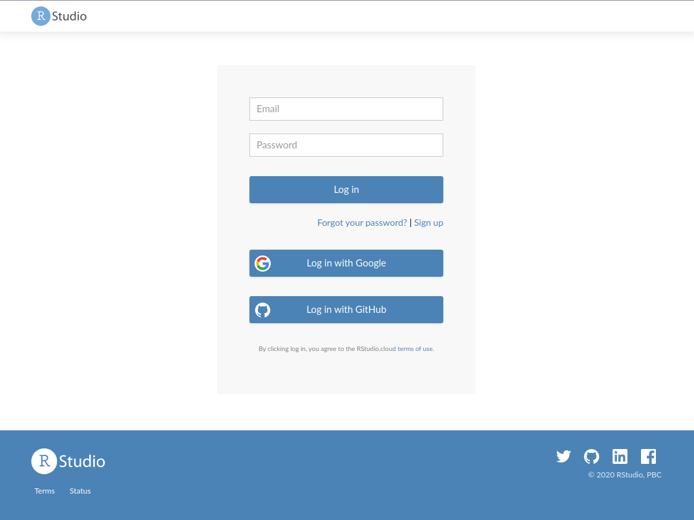
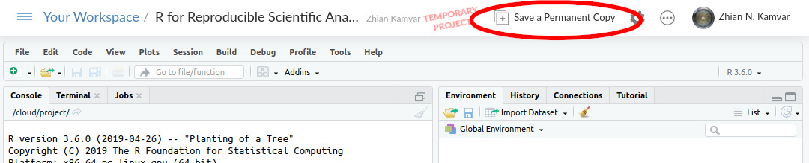

# Supporting Learners with Carpentries' Scaffolds

This document is for instructors who are looking to provide solutions for learners who have had trouble installing the required software for official Carpentries lessons. We have designed these resources (that we are calling Scaffolds) to minimize the effort required for you and the learner. We will cover the following topics here:

 - [Platforms](#platforms) 
    - [RStudio Cloud](#rstudio-cloud)
    - [My Binder](#my-binder)
 - [Links to lessons](#links-to-lessons)
 - [By Language](#by-language)
    - [Git](#git)
    - [Python](#python)
    - [R](#r)
    - [Shell](#shell)
    - [OpenRefine](#openrefine)

# Platforms

We recommend using one of two platforms for your learners depending on the
lesson type: [RStudio Cloud][rs-cloud] and [My Binder][binder]. Both of these
services are free and have default configurations that are identical or nearly
identical to the interfaces the users will have on their own machines. We will
outline their benefits and challenges in the next two sections. 

## RStudio Cloud

[RStudio Cloud][rs-cloud] is a service from [RStudio](https://rstudio.com), which is an online RStudio session that is free for the moment (they are still working on their pricing, so it may change in the future). This solution has been used in university classroom contexts for a couple of years and is stable. For more information, see this talk: <https://rstd.io/cloud-classroom>.

Advantages:

 - Familiar interface
 - Rapid setup (< 2 minutes)
 - Secure interface
 - Integrated terminal with git installed
 - Rapid package installation
 - Persistent data storage
 - Projects are private by default
 - Projects can be templated and shared (this is what we are doing)

Drawbacks:
 
 - **No nano editor**
 - Limited support for modern python
 - Only RStudio interface provided (no Jupyter Notebooks)

### Recommended Lessons

[R](#r) lessons are recommended for this solution. If you are also teaching a
shell module, it is still possible to use this solution, but inform your learners
that they should use the built in text editor for this. 

Because of the security aspect, this is the **only interface recommended for
[Git](#git) lessons**.

### How to use

You should give the learner a project link that will have the format
`https://rstudio.cloud/XXXXXXXX` where XXXXXXX is a unique project number. From
there, they should follow these steps:

1. Click on the link, which will open a login prompt. They should log in using
   one of the three provided methods.
   
2. Once they log in, they will see a temporary project screen. They should click on the "Save a permanent copy" button in the top right.
   

## My Binder

[My Binder][binder] is an open source project that is largely built for open science and reproducibility. The project is Python-centric, but is flexible enough to provide interfaces to RStudio and OpenRefine. There is no login required for users, but it can take some time for the sessions to start if new instances need to start

 - The session is served over the internet and can take anywhere from 30
   seconds to 10 minutes to start up the first time. 
 - Files can be uploaded to the session, but you cannot save your session. 
   Between sessions, learners must save the files to their computers.
 - 10 minutes of inactivity will result in the container being shut down with all data lost. 
 - Everything done in the the Binder session is visible to the world: <https://mybinder.readthedocs.io/en/latest/faq.html#can-i-push-data-from-my-binder-session-back-to-my-repository>
 - Any other concerns, please see the FAQ: https://mybinder.readthedocs.io/en/latest/faq.html 

# Links to lessons

# By Language

## Git

<http://swcarpentry.github.io/git-novice/>

Most workshops will include git as part of the content. While both RStudio
Cloud and My Binder have git installed, only RStudio Cloud is currently
recommended for use with the Git Lesson as long as each learner ensures they
have saved a copy of the materials to their own account. The primary reason for
recommending RStudio Cloud over My Binder is because sensitive information
(e.g. passwords/usernames) are not guaranteed to be secure in a Binder session.
The only way to have learners interact with git and github in an online
environment is with RStudio cloud. 

### Important caveats

 - RStudio Cloud does not have nano installed, so please ensure the learners 
   know to use use RStudio’s built-in text editor. 
 - It is not possible to copy and paste into RStudio terminals using keyboard
   shortcuts, so be sure they are aware of that. 

If you want to be able to see what your learners are doing, then you can
instruct them to use shellshare (Thanks to David Perez-Suarez for bringing our
attention to this) by copying and pasting the linux command in their terminal
at the beginning and sharing the link with you.

## Python

<https://swcarpentry.github.io/python-novice-inflammation/> 

### Important caveats

This service is not designed for many users at once, so please try to install
software on your own computer before trying this solution to avoid strain on
the system.

At the moment, there are no man pages (Zhian is hard at work to fix this!)

For Learners
Please only use this service if you have attempted to install the required software and have been unsuccessful. These instructions should replace the setup instructions on the course webpage. All the lesson materials and software will be included. Please let your instructor know if you are using this solution.

Click on this link. The Jupyter instance will take anywhere from 30 second to 10 minutes to load, so please be patient. You will see a screen that looks like this: 
Once the instance loads, enter the data/ directory and click on New > Python 3 from the dropdown menu in the top right corner. 

When you are done for the day, save your work to your computer with the download button.

You can re-upload it at the beginning of the next day (note, you have to press the upload button (1) to select your file and then confirm your upload again by pressing a second upload button (2))

For Instructors
At least half an hour before the workshop, click on the link to the instance and make sure that it loads properly. Please let the learners know that this resource is available, but stress that it is not a replacement for installing python on their own machines. Please ask your learners to inform you if they are using this solution. If you are used to teaching with Jupyter Lab, you can have your students use this url: https://mybinder.org/v2/gh/carpentries/scaffolds/swc-python-novice-inflammation?urlpath=lab 

R for Reproducible Scientific Analyses
<http://swcarpentry.github.io/r-novice-gapminder/>

This solution uses the 
For Learners
Please only use this solution if you were not successful installing R, RStudio, and Git. You should only need an internet connection for this to work. Please let your instructor know if you are using this solution.

Open this link to RStudio cloud <https://rstudio.cloud/project/1151792> and log in by either creating an account or with google/github
(NOTE: if the service gives you an error message that says “You do not have access”, reload the page to try again)
When the project loads, save a permanent copy to your workspace
Any changes you make will be saved. When you come back to your workspace, go to https://rstudio.cloud and click on the project name to open where you left off.

For Instructors
Please ask your learners if they are using this solution. All of the data should persist in their rstudio cloud account as long as they follow the instructions above. There is no nano editor for the Bash lesson, so learners will have to use the RStudio editor window when going through the Shell lesson.

OpenRefine

If anyone has trouble installing OpenRefine, they can access a My Binder instance of OpenRefine 3.2: https://mybinder.org/v2/gh/betatim/openrefineder/master?urlpath=%2Fopenrefine 

When you open this link, you will see a loading page which will take 30 seconds to 10 minutes to fully load, so please be patient.

Once it loads, you will see a window that will match an OpenRefine session. Please ignore the yellow warning bar at the top saying there is a new version of OpenRefine.

The learner can use files from their computer just like the installed version of OpenRefine. The only known issue is that it is not currently possible to upload previous OpenRefine projects. 

[binder]: https://mybinder.org
[jupyter]: https://jupyter.org/ 
[rs-cloud]: https://rstudio.cloud 
[rstudio]: https://rstudio.com 
[co-lab]: https://colab.research.google.com/
[co-calc]: https://cocalc.com/ 
[cyverse]: https://cyverse.org/atmosphere  
