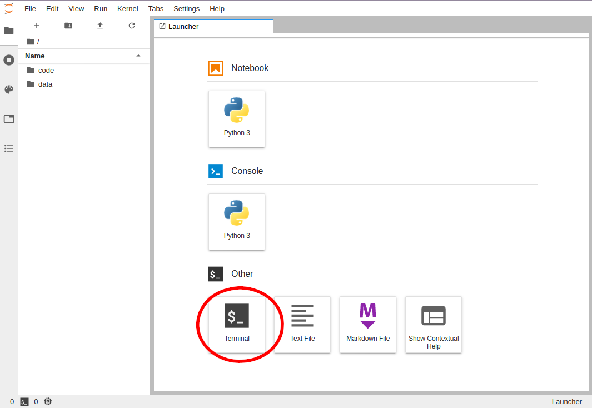

To follow along with the lesson, we will be using [My
Binder](https://mybinder.org), please follow these instructions carefully.

1. Open the link in the browser and wait for it to fully load
    (This can take anywhere from
   **30 seconds to 10 minutes to load**)
   > Note: if any error occurs, reload the page to try again.
2. Double click on the data/ directory and click on the "New" button in the top
   right to select a new Terminal window.
   
   > Note: if you are using Jupyter Lab, the interface will look slightly different:
   > 

Data in the Binder session is not persistant, you will need to download all new
scripts and data and re-upload them before and after breaks. 

For the next session, if you are using the same materials, then you should
upload your notebook (which is a three step process of pressing "Upload",
choosing the file, and then pressing "Upload" for that file) 
> Note: if you are using Jupyter Lab, the interface will look slightly different:
> 

### Please note

 - My Binder FAQ: <https://mybinder.readthedocs.io/en/latest/faq.html>
 - Everything in the binder session is temporary
 - You will need to keep the URL your instructor gave you handy. 10 minutes of
   inactivity will result in the session being shut down with all data lost. 
 - [Everything done in the the Binder session is potentially visible to the world](https://mybinder.readthedocs.io/en/latest/faq.html#can-i-push-data-from-my-binder-session-back-to-my-repository)

