# Supporting Learners with Carpentries Scaffolds

This document is for Instructors who are looking to provide solutions for
learners who have had trouble installing the required software for official
Carpentries lessons. We have designed these resources (that we are calling
Scaffolds) to minimize the effort required for you and the learner. We will
cover the following topics here:

 - [Platforms](#platforms) 
    - [RStudio Cloud](#rstudio-cloud)
    - [My Binder](#my-binder)
 - [Links to lessons](#links-to-lessons)
 - [By Topic](#by-topic)
    - [Git](#git)
    - [Python](#python)
    - [R](#r)
    - [Shell](#shell)
    - [OpenRefine](#openrefine)

# Platforms

We recommend using one of two platforms for your learners depending on the
lesson type: [RStudio Cloud][rs-cloud] and [My Binder][binder]. Both of these
services are free and have default configurations that are identical or nearly
identical to the interfaces the users will have on their own machines. We will
outline their benefits and challenges in the next two sections. 

## RStudio Cloud

[RStudio Cloud][rs-cloud] is a service from [RStudio](https://rstudio.com),
which is an online RStudio session that is currently free. This solution has
been used in university classroom contexts for a couple of years and is well maintained.
For more information, see this presentation: <https://rstd.io/cloud-classroom>.

Advantages:

 - Consistent interface
 - Rapid setup (< 2 minutes)
 - Secure interface
 - Integrated terminal with git installed
 - Rapid package installation
 - Persistent data storage
 - Projects are private by default
 - Projects can be templated and shared

Drawbacks:
 
 - **No nano text editor** (SOLUTION: use RStudio's text editor)
 - Limited support for modern Python
 - Only RStudio interface provided (no Jupyter Notebooks)

### Recommended Lessons

We recommend using this solution for [R](#r)-based workshops. If your workshop also includes a
[shell](#shell) lesson, it is still possible to use this solution, but your learners will
need to use the built in text editor within RStudio (rather than nano). 

Because of the security aspect, this is the **only interface recommended for
[Git](#git) lessons**.

### How to use

You should give the learner a project link that will have the format
`https://rstudio.cloud/XXXXXXX` where XXXXXXX is a unique project number. From
there, they should follow these steps:

> This example shows the steps for the Software Carpentry lesson "R for Reproducible Scientific Analysis":
> <https://rstudio.cloud/project/1151792>

1. Click on the link, which will open a login prompt. They should log in using
   one of the three provided methods.
   
   > Note: if the service gives you an error message that says “You do not have
   > access”, reenter the URL to try again.
2. Once they log in, they will see a temporary project screen. They should
   click on the "Save a permanent copy" button in the top right.
   
3. At this point, they will be in their own private copy of the project. Any
   changes they make will be saved. When they close their session, they can
   restore it by visiting <https://rstudio.cloud> and clicking on the project
   on their homepage
   

## My Binder

[My Binder][binder] is an open source project that is largely built for open
science and reproducibility. The project is Python-centric, but is flexible
enough to provide interfaces to RStudio and OpenRefine. There is no login
required for users, but it can take several minutes for the sessions to start if
the images have not been used recently.

FAQ: <https://mybinder.readthedocs.io/en/latest/faq.html>

Advantages:

 - Identical environment to all Python lessons teaching Jupyter Notebooks or
   Jupyter Lab.
 - Access to a full-featured shell with the nano text editor installed. 
 - Flexible interface (can also host Rstudio, JupyterLab, and OpenRefine).

Drawbacks:

 - Startup can take anywhere from 30 seconds to 10 minutes the first time
   (dependent on package installation, R-based lessons take much longer than Python lessons).  
 - Files can be uploaded to the session, but the project state does not persist.
   **Between sessions, learners must save the files to their computers.**
 - **10 minutes of inactivity will result in the container being shut down with
   all data lost.** 
 - [Everything done in the the Binder session is potentially visible to the world](https://mybinder.readthedocs.io/en/latest/faq.html#can-i-push-data-from-my-binder-session-back-to-my-repository)
 - Limit of 100 simultaneous users per repository.

### Recommended lessons

[Python](#python) lesson are a natural choice for this environment.
[Shell](#shell) lessons are also recommended for this due to the presence of
nano. [OpenRefine](#openrefine) lessons can be used through this service with
data from the user's computer. 

**Due to security issues, DO NOT use this interface for the [Git](#git) lessons.**

### How to use

You should give the learner a project link that will have the format
`https://mybinder.org/v2/gh/carpentries/scaffolds/<lesson>?urlpath=<interface>` 
where `<lesson>` is the lesson name with the curriculum prefix (e.g.,
<https://swcarpentry.github.io/shell-novice> would be `swc-shell-novice`) and
`<interface>` will be one of tree or lab to indicate Jupyter Notebook or Jupyter
Lab interface, respectively. 

You can copy these links from those listed in the [links to lessons](#links-to-lessons).

> **IMPORTANT**: because these images can take some time to load the first time, 
> please click on the link at least a half an hour before you give it to the
> learner and let it load in the background so that they don't have to wait 30
> minutes for it to load. 

Here is an example workflow from the Python-novice-inflammation lesson using Jupyter Lab:
<https://mybinder.org/v2/gh/carpentries/scaffolds/swc-python-novice-inflammation?urlpath=tree>

Once the learner has the link, here is their process:

1. Open the link in the browser and wait for it to fully load
   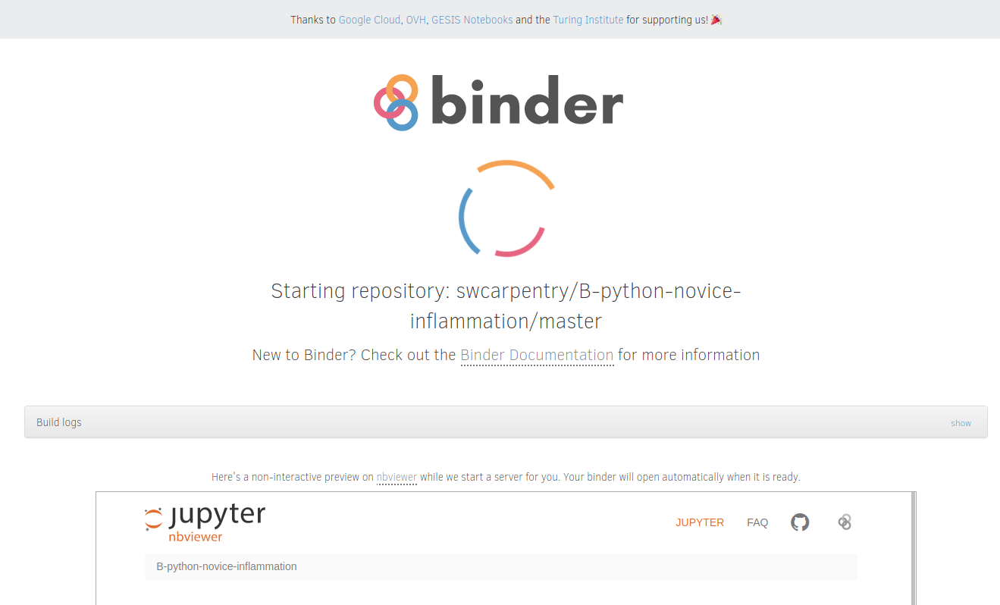
   > Note: if any error occurs, reload the page to try again.
2. Double click on the data/ directory and click on the "New" button in the top
   right to select a new Python 3 notebook.
   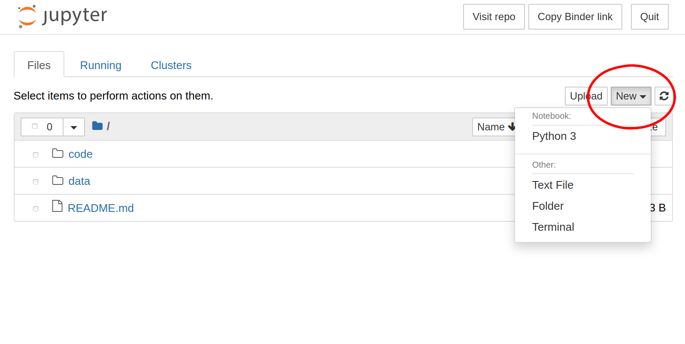
   > Note: if you are using Jupyter Lab, the interface will look slightly different:
   > 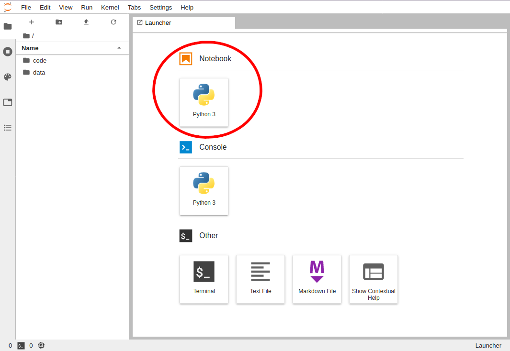

Because data is not persistant, the learner will need to download all new
scripts and data and re-upload them before and after breaks. 

1. The learner should save their work to their computer using the download button
   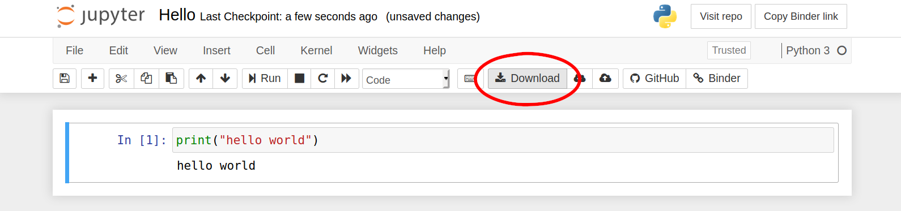
2. For the next session, if you are using the same materials, then the learner should
   upload their notebook (which is a threestep process of pressing "Upload",
   choosing the file, and then pressing "Upload" for that file)
   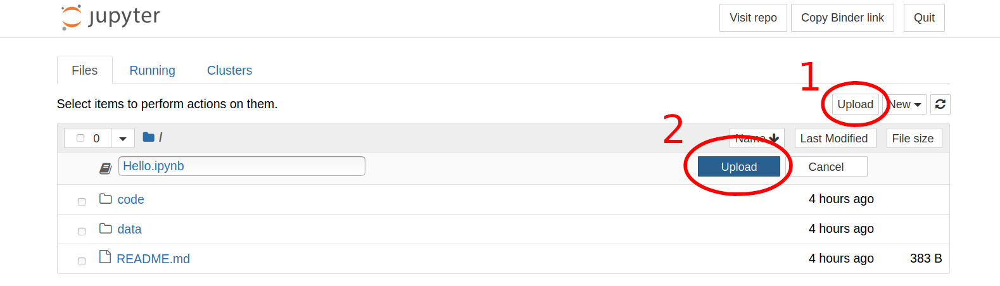
   > Note: if you are using Jupyter Lab, the interface will look slightly different:
   > 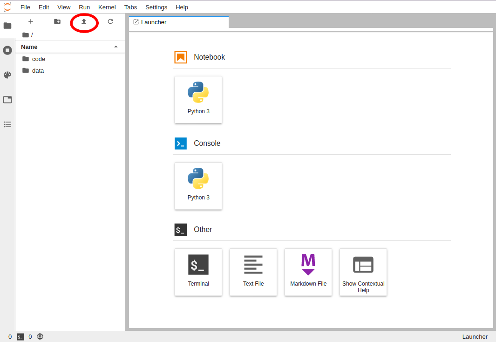

# Links to lessons

## Software Carpentry

### Shell Novice

Instructions for learners: <https://github.com/carpentries/scaffolds/blob/master/instructions/shell.md>

Jupyter Notebook: <https://mybinder.org/v2/gh/carpentries/scaffolds/swc-shell-novice?urlpath=tree>    
Jupyter Lab: <https://mybinder.org/v2/gh/carpentries/scaffolds/swc-shell-novice?urlpath=lab>

### Python Novice Inflammation

Instructions for learners: <https://github.com/carpentries/scaffolds/blob/master/instructions/python.md>

Jupyter Notebook: <https://mybinder.org/v2/gh/carpentries/scaffolds/swc-python-novice-inflammation?urlpath=tree>    
Jupyter Lab: <https://mybinder.org/v2/gh/carpentries/scaffolds/swc-python-novice-inflammation?urlpath=lab>

### Python Novice Gapminder

Instructions for learners: <https://github.com/carpentries/scaffolds/blob/master/instructions/python.md>

Jupyter Notebook: <https://mybinder.org/v2/gh/carpentries/scaffolds/swc-python-novice-gapminder?urlpath=tree>    
Jupyter Lab: <https://mybinder.org/v2/gh/carpentries/scaffolds/swc-python-novice-gapminder?urlpath=lab>

### R Novice Inflammation

Instructions for learners: <https://github.com/carpentries/scaffolds/blob/master/instructions/r.md>

Link to project: <https://rstudio.cloud/project/1167299>

### R Gapminder

Instructions for learners: <https://github.com/carpentries/scaffolds/blob/master/instructions/r.md>

Link to project: <https://rstudio.cloud/project/1151792>

## Data Carpentry

### Python Ecology

Instructions for learners: <https://github.com/carpentries/scaffolds/blob/master/instructions/python.md>

Jupyter Notebook: <https://mybinder.org/v2/gh/carpentries/scaffolds/dc-ecology-python?urlpath=tree>    
Jupyter Lab: <https://mybinder.org/v2/gh/carpentries/scaffolds/dc-ecology-python?urlpath=lab>

### R Ecology

Instructions for learners: <https://github.com/carpentries/scaffolds/blob/master/instructions/r.md>

Link to project: <https://rstudio.cloud/project/1167280>

### R Social Science

Instructions for learners: <https://github.com/carpentries/scaffolds/blob/master/instructions/r.md>

Link to Resources: <https://rstudio.cloud/project/1167422>

### R Geospatial

Instructions for learners: <https://github.com/carpentries/scaffolds/blob/master/instructions/r.md>

Link to Resources: <https://rstudio.cloud/project/1167320>

## Library Carpentry

### OpenRefine

Instructions for learners: <https://github.com/carpentries/scaffolds/blob/master/instructions/openrefine.md>

[Read instructions here](#openrefine)

# By Topic

## Git

<http://swcarpentry.github.io/git-novice/>

Most workshops will include git as part of the content. While both [RStudio
Cloud][rs-cloud] and [My Binder][binder] have git installed, only RStudio Cloud
is currently recommended for use with the Git Lesson as long as each learner
ensures they have saved a copy of the materials to their own account. The
primary reason for recommending RStudio Cloud over My Binder is because
sensitive information (e.g. passwords/usernames) are not guaranteed to be
secure in a Binder session. **The only secure way to have learners interact
with git and github in an online environment is with RStudio Cloud.**

Because this lesson creates all the materials, you can instruct the users to
create a new project via RStudio cloud. We have provided [information for
using RStudio Cloud](#rstudio-cloud) in this document.

Here are the steps for setting up a Git session within RStudio Cloud:

#### Creating an RStudio Cloud account

> Note, if they already have an RStudio Cloud account, they can skip this step

1. Navigate your browser to <https://rstudio.cloud> and login/sign up as needed
  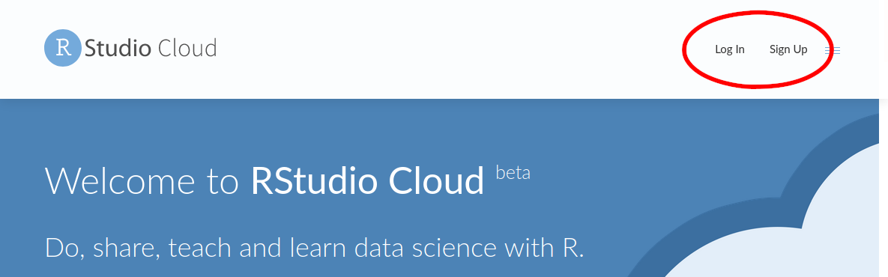

##### Creating a New Project

2. Once signed in, click on the "New Project" button
  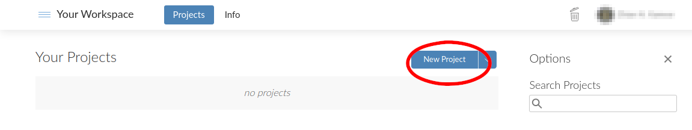
3. For consistency, when RStudio opens, create a new folder called "Desktop"
  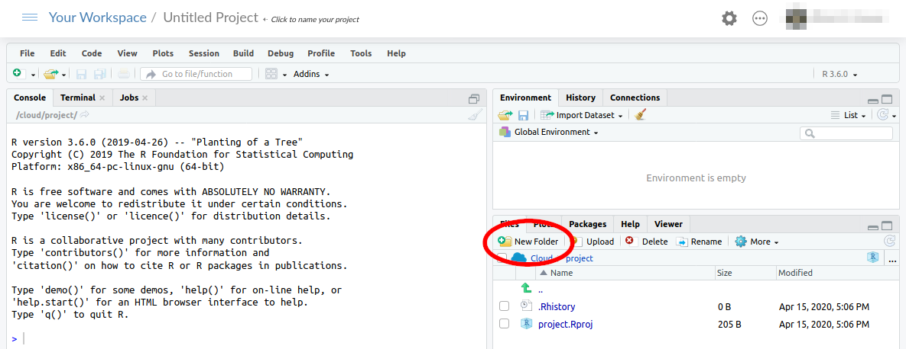
4. Click on the "Terminal" tab in the top left of the console window
  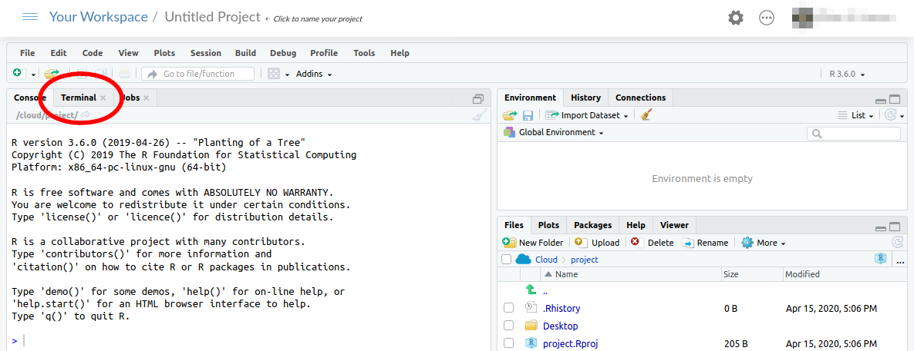
5. The command prompt will look similar to this image
  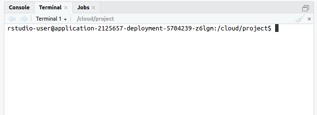

### Important caveats

 - RStudio Cloud does not have the nano text editor installed, so please ensure the learners 
   know to use use RStudio’s built-in text editor. 
 - It is not possible to copy and paste into RStudio terminals using keyboard
   shortcuts, so be sure they are aware of that. 

<!-- If you want to be able to see what your learners are doing, then you can -->
<!-- instruct them to use shellshare (Thanks to David Perez-Suarez for bringing our -->
<!-- attention to this) by copying and pasting the linux command in their terminal -->
<!-- at the beginning and sharing the link with you. -->

## Python

Python lessons should be hosted via [My Binder][binder]. Please [read our 
documentation on My Binder](#my-binder) for details. 

**At least half an hour before the workshop**, click on the link to the instance
and make sure that it loads properly. Please let the learners know that this
resource is available, but stress that it is not a replacement for installing
python on their own machines. Please ask your learners to inform you if they
are using this solution.

## R

R lessons should be hosted via [RStudio Cloud][rs-cloud]. Please [read our
documentation on RStudio Cloud](#rstudio-cloud) for details.

RStudio Cloud DOES NOT have the nano text editor installed, so your learners will have to use
the text editor in RStudio to create files.

## Shell

Shell lessons can be hosted via either [My Binder][binder] or [RStudio
Cloud][rs-cloud], depending on the context. 

### Context: stand-alone shell workshop

If the shell lesson is a stand-alone lesson, then we recommend using My Binder
because it will have the closest interface to a standalone shell as it has nano
installed. If you would like to use this option, then please [read our 
documentation on My Binder](#my-binder) for details and caveats.

> **Important caveat:** data is not persistant in the cloud, so any new data
> must be saved to the user's computer beforehand. 

### Context: Python workshop with shell component

The [My Binder interface](#my-binder) works well with this type of workshop. 
Please [read our documentation on My Binder](#my-binder) for details and caveats.

> **Important caveat:** data is not persistant in the cloud, so any new data
> must be saved to the user's computer beforehand. 

### Context: R workshop with shell component

In this case, you will be using [RStudio Cloud](#rstudio-cloud) and it's best
to instruct learners to use the terminal inside of the RStudio window. The
learners can open the terminal like this:

1. Click on the "Terminal" tab in the top left of the console window
  
2. The command prompt will look similar to this image
  

Please [read our documentation on RStudio Cloud](#rstudio-cloud) for details and
caveats.
 
> **Important caveat:** the nano text editor is not installed, so please instruct the learners to
> create a new text file when they need to use nano: 
> <kbd>File > New File > Text File</kbd>

## OpenRefine

If anyone has trouble installing OpenRefine, they can access a [My
Binder][binder] instance of OpenRefine 3.2:
<https://mybinder.org/v2/gh/betatim/openrefineder/master?urlpath=%2Fopenrefine>

Please [read our documentation on My Binder](#my-binder) for details and caveats.

Give the above URL to the learners and have them click on the link. 

When learners open this link, they will see a loading page which will take 30
seconds to 10 minutes to fully load, so please be patient.

Once it loads, the learners will see a window that will match an OpenRefine
session. Please ignore the yellow warning bar at the top saying there is a new
version of OpenRefine.

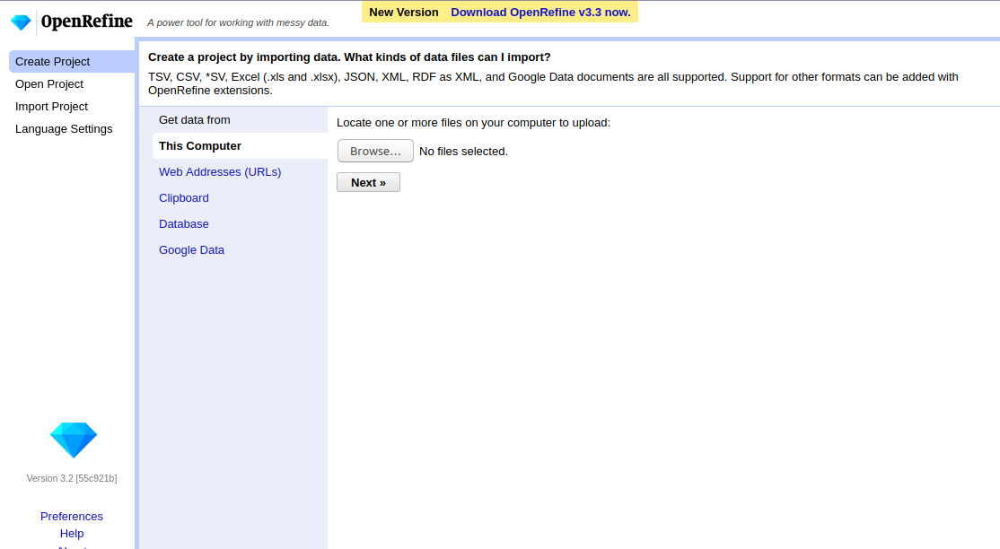

The learner can use files from their computer just like the installed
version of OpenRefine. The only known issue is that it is not currently
possible to upload previous OpenRefine projects. 

[binder]: https://mybinder.org
[jupyter]: https://jupyter.org/ 
[rs-cloud]: https://rstudio.cloud 
[rstudio]: https://rstudio.com 
[co-lab]: https://colab.research.google.com/
[co-calc]: https://cocalc.com/ 
[cyverse]: https://cyverse.org/atmosphere  
